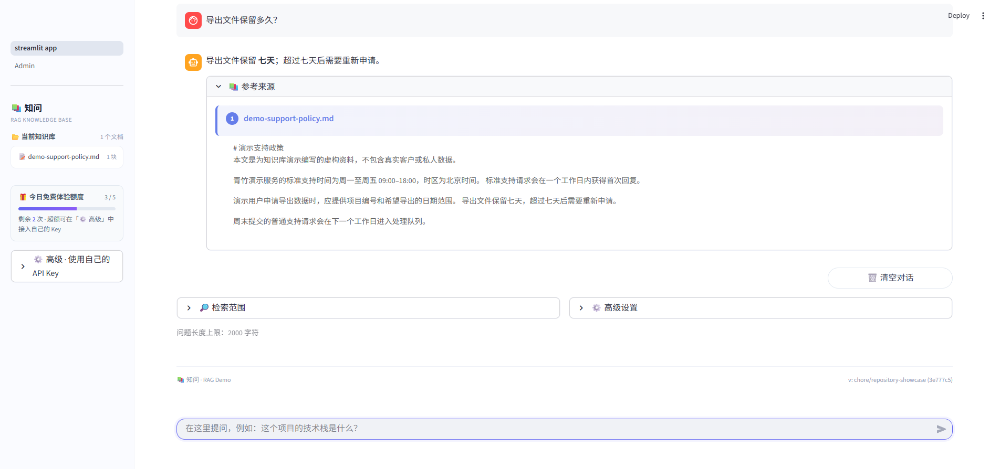

# 真实 RAG 演示

本演示使用一份公开仓库内的新编虚构资料，展示从文档入库到回答溯源的完整路径。演示不使用私人文档或预置答案。

## 演示场景

- 文件：[demo-support-policy.md](examples/demo-support-policy.md)
- 问题：`导出文件保留多久？`
- 预期事实：导出文件保留七天，超过七天后需要重新申请。
- 关键观察点：回答包含该事实，参考来源显示 `demo-support-policy.md`，展开后能看到支持回答的原文。

截图来自 2026-09-14 的本地隔离环境验收，页面只包含虚构资料。回答内容可能因模型措辞略有变化，但事实和来源应可由文件原文核对。

## 操作步骤

1. 按 [README 的本地启动说明](../README.md) 配置聊天和嵌入模型，并启动后端与 Streamlit 前端。Key 只通过安全环境变量提供。
2. 打开前端的 Admin 页面登录管理员，返回主页。
3. 在侧栏选择 [demo-support-policy.md](examples/demo-support-policy.md)，点击“上传文件”。
4. 等待异步任务显示完成，并确认知识库显示该文件和 1 个分块。上传成功进入队列不等于处理完成。
5. 在聊天框输入“导出文件保留多久？”。
6. 检查回答中的“七天”和“超过七天后需要重新申请”，展开“参考来源”，核对文件名及原文。

## 验收范围

A05 已在独立运行目录中验证真实 Qwen 嵌入、Chroma 入库、DeepSeek 回答和浏览器来源展示。Docker 构建、OCR、HTTPS、生产部署及全量覆盖率不属于本演示的验收范围。浏览器截图展示的是已验证结果；重新执行时可能命中问答缓存。

运行数据、任务记录、缓存、向量库和密钥不属于公开演示材料，不应复制到仓库。
